# Workshop-8 Report - Frontend

## Screenshots

In this section you can find screenshots of the implemented features.

### Root Page

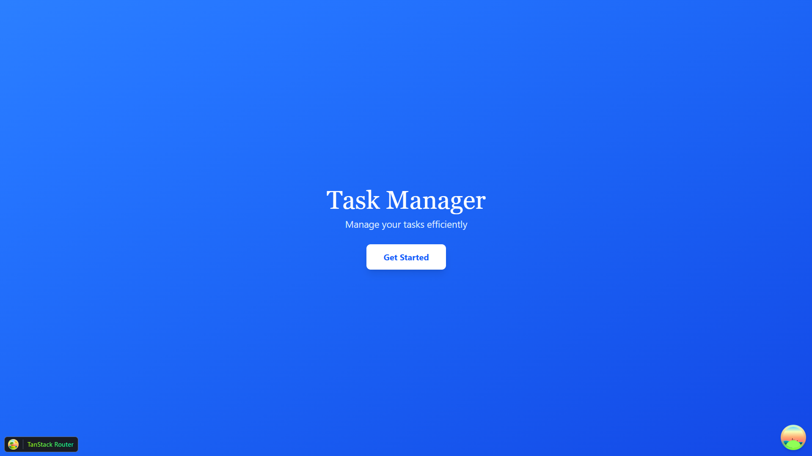

### Login Page

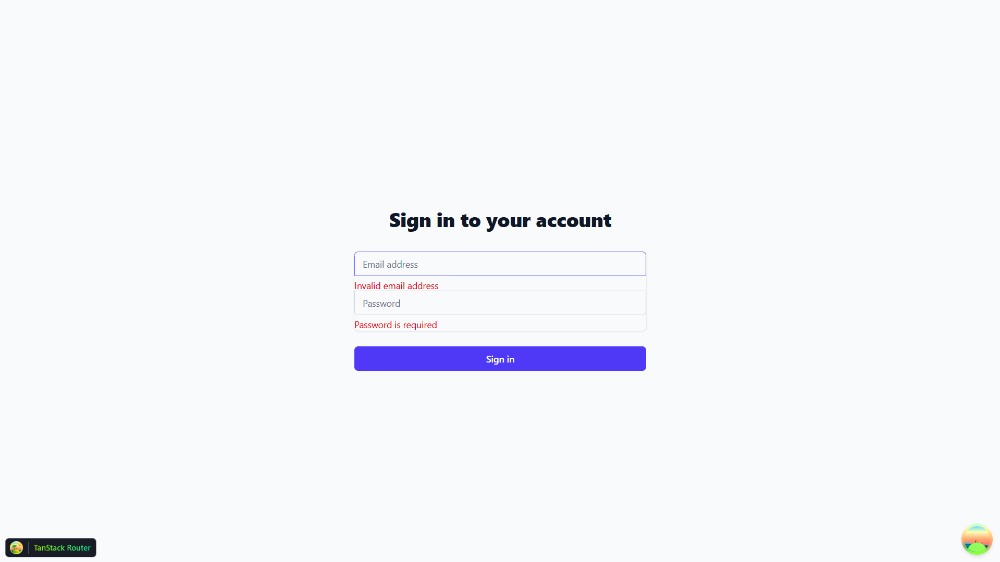

### Dashboard Page

### Types Page

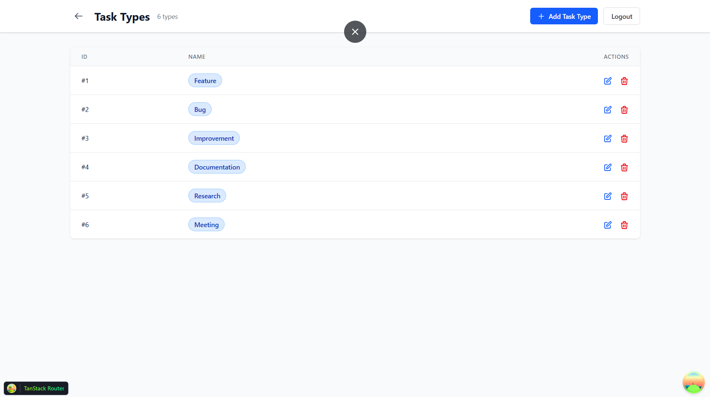

### Create Task Modal

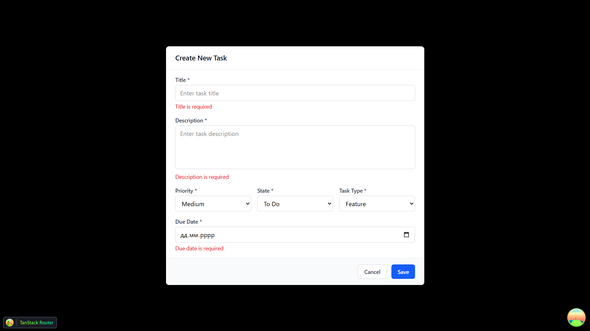

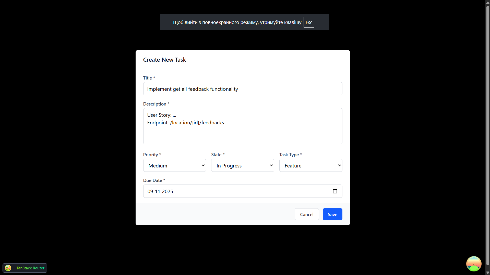

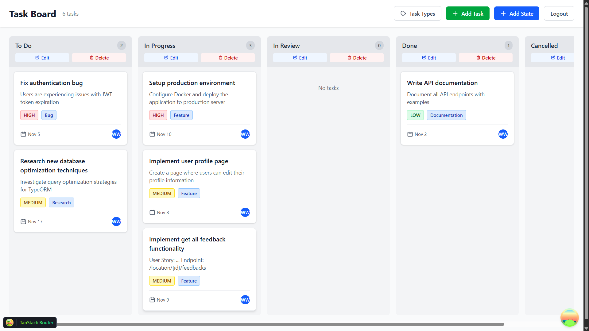

### Edit Task Modal

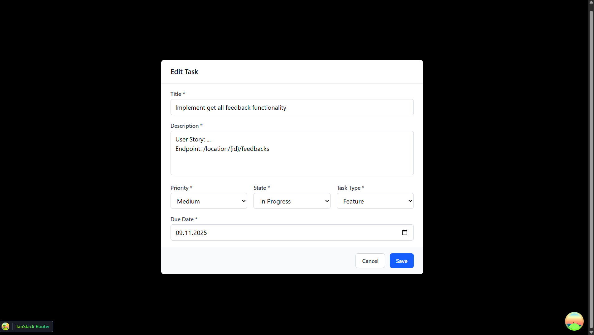

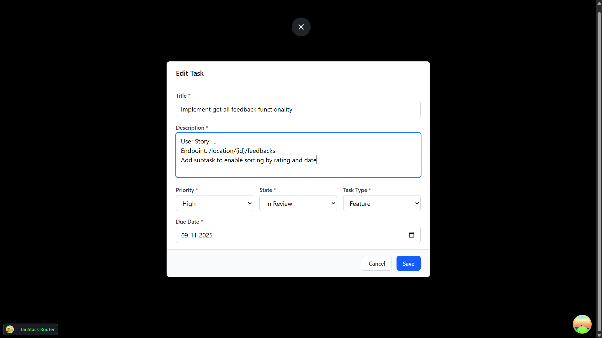

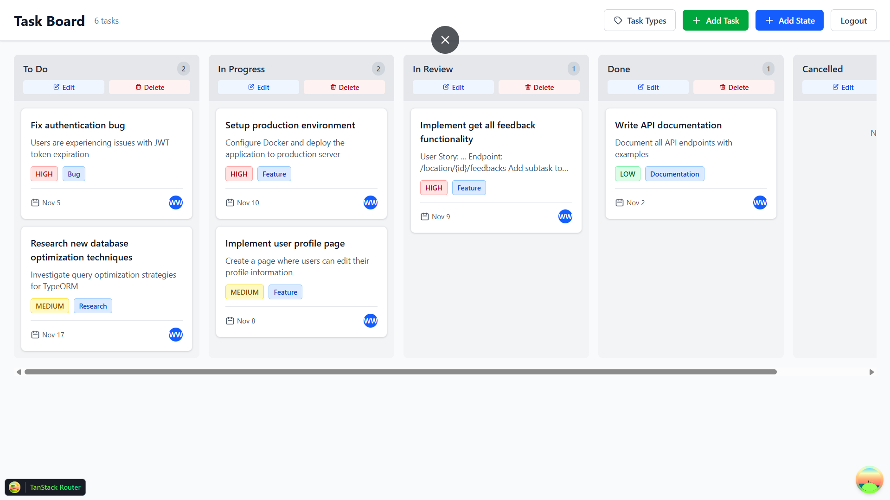

### View Task Modal

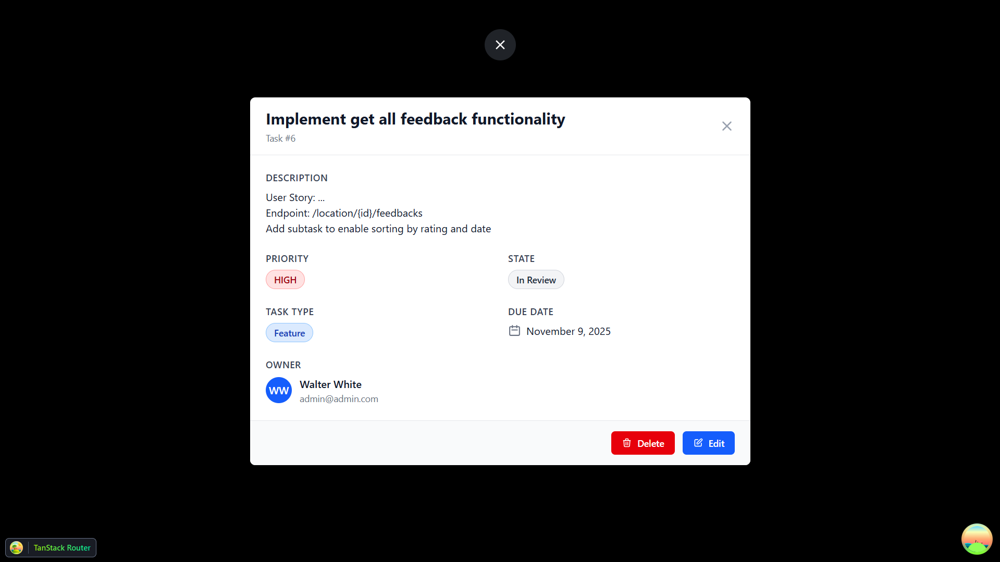

### Delete Task Modal

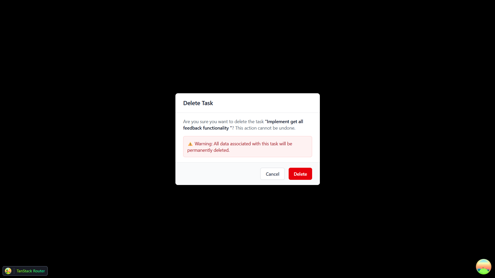

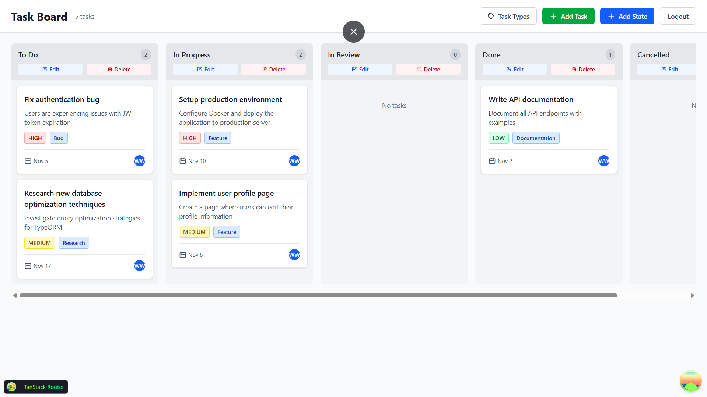

## Video Demonstration

I guess provided screenshots will be enough. However, in case you need to see all functionalities in action, 
you can find a video demonstration of the implemented features here: 
[Video Demonstration](https://www.youtube.com/watch?v=9OtyIDttCYY)

## Issue that I faced

While implementing the deletion of a state I understood that I had forgotten to adjust cascade deletion in the database schema.
So I had to update the mutation (1590519635401-SeedUsers) to include `ON DELETE CASCADE` for the foreign key constraint 
between `states` and `tasks` tables. (and `task_types` and `tasks` tables as well).
This change ensures that when a state or task type is deleted, all associated tasks are also removed from the database.