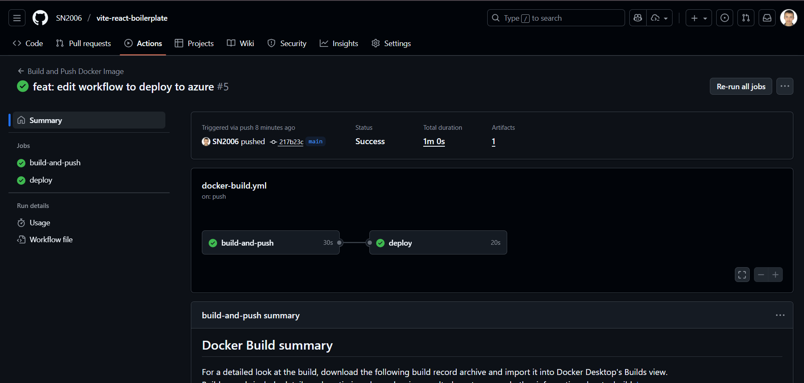
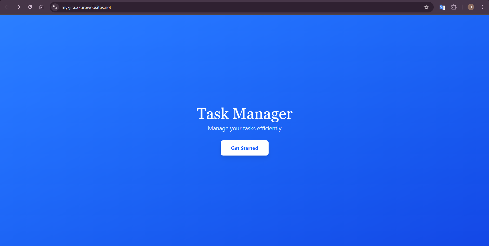

# CI Workshop

This .md file is a report that was created as a result of CD Workshop

## Step 1: Create a web app on Azure

I have created a web app on Azure with the name `my-jira` 
in the resource group `my-resource-group`.

I don`t think it is necessary to provide screenshots for this step.

## Step 2: Create a new job on our current GitHub workflow

During this step the following job was added to the existing workflow: 
```yml
  deploy:
    needs: build-and-push
    runs-on: ubuntu-latest

    steps:
      - uses: azure/login@v2
        with:
          creds: ${{ secrets.AZURE_CREDENTIALS }}
      - name: Deploy to Azure Web App
        uses: azure/webapps-deploy@v2
        with:
          app-name: my-jira
          images: ghcr.io/sn2006/${{ github.event.repository.name }}:latest
```

So the complete workflow now looks like this:
```yml
name: Build and Push Docker Image

on:
  push:
    branches:
      - main
      - feature/*
  workflow_dispatch:

jobs:
  build-and-push:
    runs-on: ubuntu-latest

    steps:
      - uses: actions/checkout@v4

      - name: Install pnpm and build project
        run: |
          npm install -g pnpm
          pnpm install
          pnpm run build

      - name: Login to GitHub Container Registry
        uses: docker/login-action@v3
        with:
          registry: ghcr.io
          username: ${{ github.actor }}
          password: ${{ secrets.GITHUB_TOKEN }}

      - name: Build and push Docker image
        uses: docker/build-push-action@v6
        with:
          context: .
          push: true
          tags: ghcr.io/sn2006/${{ github.event.repository.name }}:latest
  deploy:
    needs: build-and-push
    runs-on: ubuntu-latest

    steps:
      - uses: azure/login@v2
        with:
          creds: ${{ secrets.AZURE_CREDENTIALS }}
      - name: Deploy to Azure Web App
        uses: azure/webapps-deploy@v2
        with:
          app-name: my-jira
          images: ghcr.io/sn2006/${{ github.event.repository.name }}:latest
```

## Step 3: Push changes to trigger the workflow

So, after pushing the changes I was able to see that both jobs were executed successfully:



And finally, I was able to access the web app deployed on Azure:



You can find this app at this [link](https://my-jira.azurewebsites.net/) (If it will be still available).

**Note**: I can`t say that you can try all the functionality of this app, 
because it requires backend service which were not deployed. 
But at least the app is loading correctly.