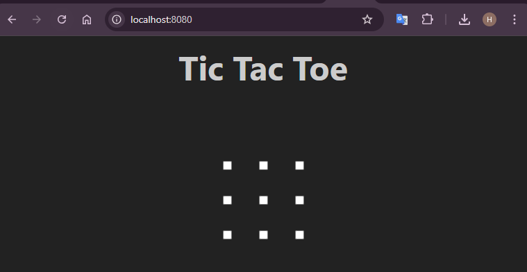
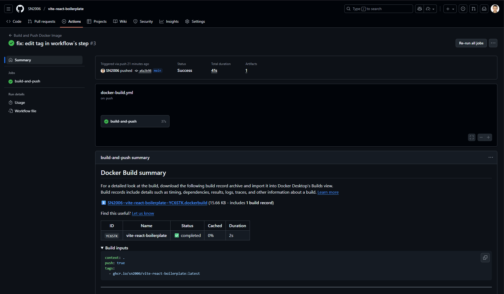

# CI Workshop

This .md file is a report that was created as a result of CI Workshop

## Exercise 1: Complete courses

### Course 1: Hello GitHub Actions

You can find the repository with the completed course [here](https://github.com/SN2006/skills-hello-github-actions).

### Course 2: GitHub Actions for CI/CD

You can find the repository with the completed course [here](https://github.com/SN2006/skills-publish-packages)

As a result of this course, I pulled a Docker image and here is the proves of it:

```bash
docker run -dp 8080:80 --rm 06d0c3624877 
```



## Exercise 2: Create a GitHub Actions workflow

During this exercise the following workflow was created: 

```yml
name: Build and Push Docker Image

on:
  push:
    branches:
      - main
      - feature/*
  workflow_dispatch:

jobs:
  build-and-push:
    runs-on: ubuntu-latest

    steps:
      - uses: actions/checkout@v4

      - name: Install pnpm and build project
        run: |
          npm install -g pnpm
          pnpm install
          pnpm run build

      - name: Login to GitHub Container Registry
        uses: docker/login-action@v3
        with:
          registry: ghcr.io
          username: ${{ github.actor }}
          password: ${{ secrets.GITHUB_TOKEN }}

      - name: Build and push Docker image
        uses: docker/build-push-action@v6
        with:
          context: .
          push: true
          tags: ghcr.io/sn2006/${{ github.event.repository.name }}:latest

```

You can find it here: [workflow file](https://github.com/SN2006/vite-react-boilerplate/blob/main/.github/workflows/docker-build.yml)

The workflow builds and pushes a Docker image to GitHub Container Registry (GHCR) whenever there is a push to the main branch or any feature/* branch. It can also be triggered manually via the GitHub Actions tab.

Here is the result of a successful workflow run:
